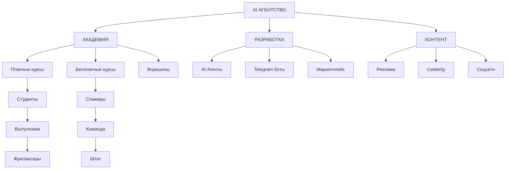

# 📊 Настройка Obsidian для AI АГЕНТСТВА

## 🎯 **Структура папок в Obsidian**

```
AI_AGENCY_VAULT/
├── 📋 Projects/
│   ├── MVP_Development
│   ├── Telegram_Parser
│   ├── Content_Production
│   └── Academy_Courses
├── 👥 People/
│   ├── Students/
│   ├── Team/
│   ├── Clients/
│   └── Celebrities/
├── 📚 Knowledge/
│   ├── AI_Tools/
│   ├── Marketing/
│   ├── Development/
│   └── Business/
├── 📅 Planning/
│   ├── Roadmap_2025
│   ├── Weekly_Reviews
│   ├── Monthly_Goals
│   └── Quarterly_OKRs
├── 💰 Business/
│   ├── Revenue_Streams
│   ├── Expenses
│   ├── Partnerships
│   └── Metrics
└── 🎬 Content/
    ├── Video_Ideas
    ├── Blog_Posts
    ├── Social_Media
    └── Campaigns
```

## 🏷️ **Система тегов**

### 📊 **Статусы проектов:**
- `#status/planning` - в планах
- `#status/in-progress` - в работе  
- `#status/review` - на ревью
- `#status/completed` - завершено
- `#status/on-hold` - приостановлено

### 🎯 **Приоритеты:**
- `#priority/high` - высокий
- `#priority/medium` - средний
- `#priority/low` - низкий

### 🏢 **Категории бизнеса:**
- `#academy` - образование
- `#development` - разработка
- `#content` - контент
- `#marketing` - маркетинг
- `#sales` - продажи

### 👥 **Типы людей:**
- `#person/student` - ученик
- `#person/team` - команда
- `#person/client` - клиент
- `#person/celebrity` - знаменитость
- `#person/partner` - партнер

## 🔗 **Шаблоны заметок**

### 📋 **Шаблон проекта:**
```markdown
# {{title}}

## 🎯 Цель
- 

## 📅 Сроки
- Начало: 
- Дедлайн: 
- Статус: #status/

## 👥 Команда
- Ответственный: [[]]
- Участники: [[]], [[]]

## 📊 Метрики успеха
- [ ] 
- [ ] 

## 📝 Задачи
- [ ] 
- [ ] 

## 🔗 Связанные проекты
- [[]]

## 📈 Прогресс
### Неделя 1
- 

### Неделя 2
- 

## 💡 Заметки
- 

---
Теги: #project #priority/ #status/
```

### 👤 **Шаблон человека:**
```markdown
# {{name}}

## 📋 Основная информация
- Роль: 
- Контакты: 
- Telegram: 
- Email: 

## 🎯 Проекты
- [[]]
- [[]]

## 💰 Финансы
- Зарплата/Гонорар: 
- Комиссия: 
- Реферальные: 

## 📈 Метрики
- Выполненные проекты: 
- Рейтинг: 
- Отзывы: 

## 📝 Заметки
- 

---
Теги: #person/ #
```

### 💰 **Шаблон источника дохода:**
```markdown
# {{название}}

## 💰 Финансы
- Тип: (разовый/регулярный)
- Сумма: 
- Частота: 
- Маржинальность: 

## 📊 Метрики
- MRR: 
- LTV: 
- CAC: 
- Churn Rate: 

## 🎯 Цели
- [ ] 
- [ ] 

## 📈 Динамика
### Январь
- 

### Февраль
- 

---
Теги: #revenue #business
```

## 🌐 **Граф связей**

### 🔗 **Основные связи:**



## 🎨 **Визуализация в Tilda**

### 📊 **Интерактивный roadmap:**

**HTML структура:**
```html
<div class="roadmap-container">
  <div class="quarter q1">
    <h3>Q1 2025: Foundation</h3>
    <div class="progress-bar">
      <div class="progress" data-progress="25%"></div>
    </div>
    <ul class="milestones">
      <li class="completed">✅ MVP разработка</li>
      <li class="in-progress">🔄 Первые ученики</li>
      <li class="planned">📅 Celebrity проекты</li>
    </ul>
  </div>
</div>
```

**CSS стили:**
```css
.roadmap-container {
  display: grid;
  grid-template-columns: repeat(4, 1fr);
  gap: 20px;
  margin: 40px 0;
}

.quarter {
  background: linear-gradient(135deg, #667eea 0%, #764ba2 100%);
  padding: 30px;
  border-radius: 15px;
  color: white;
}

.progress-bar {
  background: rgba(255,255,255,0.3);
  height: 10px;
  border-radius: 5px;
  overflow: hidden;
  margin: 20px 0;
}

.progress {
  background: #4CAF50;
  height: 100%;
  border-radius: 5px;
  transition: width 0.5s ease;
}

.milestones li {
  margin: 10px 0;
  padding: 8px 0;
  border-bottom: 1px solid rgba(255,255,255,0.2);
}

.completed { color: #4CAF50; }
.in-progress { color: #FF9800; }
.planned { color: #9E9E9E; }
```

### 📈 **Дашборд метрик:**

**JavaScript для обновления:**
```javascript
// Обновление метрик в реальном времени
function updateMetrics() {
  fetch('/api/metrics')
    .then(response => response.json())
    .then(data => {
      document.getElementById('students-count').textContent = data.students;
      document.getElementById('revenue-amount').textContent = '$' + data.revenue;
      document.getElementById('projects-count').textContent = data.projects;
      
      // Обновление прогресс-баров
      updateProgressBars(data.progress);
    });
}

function updateProgressBars(progress) {
  Object.keys(progress).forEach(key => {
    const bar = document.querySelector(`[data-metric="${key}"] .progress`);
    if (bar) {
      bar.style.width = progress[key] + '%';
    }
  });
}

// Обновление каждые 30 секунд
setInterval(updateMetrics, 30000);
```

## 🔧 **Плагины Obsidian**

### 📊 **Рекомендуемые плагины:**

1. **Dataview** - SQL-запросы к заметкам
2. **Kanban** - доски задач
3. **Calendar** - календарное планирование
4. **Graph Analysis** - анализ связей
5. **Templater** - продвинутые шаблоны
6. **Charts** - графики и диаграммы
7. **Timeline** - временные линии

### 📝 **Dataview запросы:**

**Активные проекты:**
```dataview
TABLE status, priority, deadline
FROM #project 
WHERE status = "in-progress"
SORT priority DESC
```

**Команда по ролям:**
```dataview
LIST 
FROM #person/team 
GROUP BY role
```

**Доходы по месяцам:**
```dataview
TABLE sum(amount) as "Total"
FROM #revenue 
GROUP BY dateformat(date, "yyyy-MM")
```

## 🎯 **Автоматизация**

### 🔄 **Ежедневные обновления:**
- Автоматическое создание дневных заметок
- Синхронизация с календарем
- Обновление метрик проектов

### 📊 **Еженедельные отчеты:**
- Сводка по проектам
- Анализ прогресса
- Планирование следующей недели

### 📈 **Месячные аналитики:**
- Финансовые отчеты
- Анализ команды
- Корректировка roadmap

---

**🚀 Готово к интеграции с любыми инструментами визуализации!** 