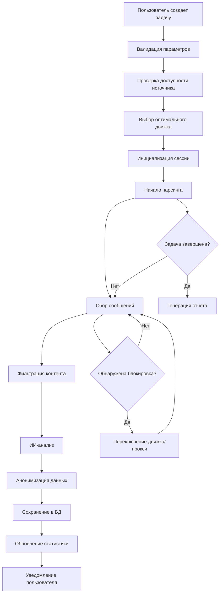

# 🕉️ Универсальный Telegram Парсер - Анализ и MVP

> *"सर्वे भवन्तु सुखिनः सर्वे सन्तु निरामयाः। सर्वे भद्राणि पश्यन्तु मा कश्चिद्दुःखभाग्भवेत्॥"*
> 
> *"Пусть все будут счастливы, пусть все будут здоровы. Пусть все видят благополучие, пусть никто не страдает."*

## 📊 Анализ Современных Подходов

### 🏆 Сравнение Библиотек для Telegram Парсинга

| Библиотека | Тип | Преимущества | Недостатки | Рейтинг |
|------------|-----|-------------|------------|---------|
| **Telethon** | MTProto Client | ✅ Полный доступ к API<br>✅ User + Bot режимы<br>✅ Нет лимитов файлов<br>✅ Активное сообщество | ⚠️ Сложность настройки<br>⚠️ Требует API ключи | ⭐⭐⭐⭐⭐ |
| **Pyrogram** | MTProto Client | ✅ Современный синтаксис<br>✅ Async/await<br>✅ Хорошая документация<br>✅ Простота использования | ⚠️ Меньшее сообщество<br>⚠️ Некоторые ограничения | ⭐⭐⭐⭐⭐ |
| **python-telegram-bot** | Bot API | ✅ Простота для ботов<br>✅ Отличная документация<br>✅ Стабильность | ❌ Только боты<br>❌ Лимиты Bot API<br>❌ Нет доступа к истории | ⭐⭐⭐ |
| **Telegraf (Node.js)** | Bot API | ✅ Middleware система<br>✅ TypeScript поддержка<br>✅ Производительность | ❌ Только боты<br>❌ Лимиты Bot API | ⭐⭐⭐ |

### 🎯 Рекомендуемое Решение: **Pyrogram + Telethon Hybrid**

**Обоснование:**
- **Pyrogram** - основной движок (современность, простота)
- **Telethon** - резервный движок (стабильность, функциональность)
- **Hybrid архитектура** - максимальная надежность

## ⚖️ Правовой и Этический Анализ

### 📋 Правовая Матрица

| Аспект | Статус | Рекомендации |
|--------|--------|-------------|
| **Публичные каналы** | ✅ Легально | Соблюдать robots.txt и ToS |
| **Публичные группы** | ✅ Легально | Минимизировать персональные данные |
| **Приватные каналы** | ⚠️ Рискованно | Только с разрешения |
| **Приватные группы** | ❌ Запрещено | Не рекомендуется |
| **Персональные данные** | ⚠️ GDPR/CCPA | Анонимизация обязательна |

### 🛡️ Этические Принципы

1. **Прозрачность** - четкое объяснение целей сбора данных
2. **Минимизация** - сбор только необходимых данных
3. **Анонимизация** - защита персональных данных
4. **Уважение** - соблюдение ToS и пользовательских настроек
5. **Безопасность** - защищенное хранение и передача данных

## 🏗️ Архитектура MVP

### 📦 Компоненты Системы

```
📁 telegram_parser_mvp/
├── 🔧 core/
│   ├── engines/
│   │   ├── pyrogram_engine.py     # Основной движок
│   │   ├── telethon_engine.py     # Резервный движок
│   │   └── hybrid_engine.py       # Управление движками
│   ├── parsers/
│   │   ├── channel_parser.py      # Парсинг каналов
│   │   ├── group_parser.py        # Парсинг групп
│   │   ├── message_parser.py      # Парсинг сообщений
│   │   └── media_parser.py        # Парсинг медиа
│   ├── filters/
│   │   ├── content_filter.py      # Фильтрация контента
│   │   ├── privacy_filter.py      # Фильтрация ПД
│   │   └── keyword_filter.py      # Ключевые слова
│   └── storage/
│       ├── database.py            # База данных
│       ├── export.py              # Экспорт данных
│       └── cache.py               # Кэширование
├── 🤖 ai/
│   ├── sentiment_analyzer.py      # Анализ тональности
│   ├── topic_extractor.py         # Извлечение тем
│   ├── language_detector.py       # Определение языка
│   └── pattern_recognizer.py      # Распознавание паттернов
├── 🔒 security/
│   ├── rate_limiter.py           # Ограничение скорости
│   ├── proxy_manager.py          # Управление прокси
│   ├── anonymizer.py             # Анонимизация
│   └── encryption.py             # Шифрование
├── 📊 analytics/
│   ├── statistics.py             # Статистика
│   ├── visualizer.py             # Визуализация
│   ├── reporter.py               # Отчеты
│   └── insights.py               # Инсайты
├── 🌐 api/
│   ├── rest_api.py               # REST API
│   ├── websocket_api.py          # WebSocket API
│   └── auth.py                   # Аутентификация
├── 🖥️ web/
│   ├── dashboard.py              # Веб-интерфейс
│   ├── templates/                # HTML шаблоны
│   └── static/                   # CSS/JS
├── ⚙️ config/
│   ├── settings.py               # Настройки
│   ├── logging.py                # Логирование
│   └── secrets.py                # Секреты
└── 📝 utils/
    ├── validators.py             # Валидация
    ├── helpers.py                # Вспомогательные функции
    └── exceptions.py             # Исключения
```

### 🚀 Ключевые Возможности MVP

#### 1. 🎯 Умный Парсинг
- **Адаптивные алгоритмы** - автоматическое определение структуры
- **Многопоточность** - параллельная обработка
- **Отказоустойчивость** - автоматическое переключение движков
- **Антидетект** - ротация прокси и user-agent

#### 2. 🧠 ИИ-Анализ
- **Анализ тональности** - определение эмоций в сообщениях
- **Извлечение тем** - автоматическая категоризация
- **Обнаружение трендов** - выявление популярных тем
- **Анализ аудитории** - профилирование пользователей

#### 3. 🔍 Продвинутая Фильтрация
- **Ключевые слова** - гибкие фильтры по содержанию
- **Временные рамки** - парсинг за определенный период
- **Типы контента** - текст, медиа, ссылки
- **Активность пользователей** - фильтрация по активности

#### 4. 📊 Аналитика и Визуализация
- **Дашборд в реальном времени** - мониторинг процесса
- **Интерактивные графики** - визуализация данных
- **Экспорт отчетов** - PDF, Excel, JSON
- **API для интеграции** - подключение к внешним системам

## 💻 Техническая Реализация

### 🔧 Основные Технологии

```python
# Стек технологий
TECH_STACK = {
    "backend": {
        "language": "Python 3.11+",
        "frameworks": ["FastAPI", "SQLAlchemy", "Pydantic"],
        "telegram": ["Pyrogram", "Telethon"],
        "ai": ["transformers", "spacy", "scikit-learn"],
        "database": ["PostgreSQL", "Redis"],
        "queue": ["Celery", "RQ"]
    },
    "frontend": {
        "framework": "React + TypeScript",
        "ui": ["Material-UI", "Chart.js", "D3.js"],
        "state": "Redux Toolkit",
        "build": "Vite"
    },
    "infrastructure": {
        "containerization": "Docker + Docker Compose",
        "monitoring": ["Prometheus", "Grafana"],
        "logging": ["ELK Stack"],
        "deployment": ["GitHub Actions", "Kubernetes"]
    }
}
```

### 🔐 Безопасность и Соответствие

#### Защита Данных
- **Шифрование** - AES-256 для хранения, TLS для передачи
- **Анонимизация** - автоматическое удаление ПД
- **Контроль доступа** - RBAC с JWT токенами
- **Аудит** - логирование всех операций

#### Соответствие Требованиям
- **GDPR** - право на забвение, портируемость данных
- **CCPA** - уведомления о сборе данных
- **Telegram ToS** - соблюдение ограничений API
- **Этические принципы** - минимизация вреда

### ⚡ Производительность

#### Оптимизация
- **Асинхронная обработка** - asyncio для I/O операций
- **Кэширование** - Redis для часто запрашиваемых данных
- **Батчинг** - группировка запросов к API
- **Компрессия** - сжатие данных при хранении

#### Масштабируемость
- **Горизонтальное масштабирование** - микросервисная архитектура
- **Балансировка нагрузки** - распределение запросов
- **Очереди задач** - фоновая обработка
- **Мониторинг** - отслеживание метрик производительности

## 🎛️ Пользовательский Интерфейс

### 📱 Веб-Дашборд

#### Главная страница
```
┌─────────────────────────────────────────────────────────┐
│ 🚀 Telegram Parser Pro                    👤 Профиль   │
├─────────────────────────────────────────────────────────┤
│                                                         │
│ 📊 Статистика                                          │
│ ┌─────────┐ ┌─────────┐ ┌─────────┐ ┌─────────┐        │
│ │ Каналы  │ │ Группы  │ │Сообщения│ │Медиафайлы│        │
│ │  1,234  │ │   567   │ │ 89,012  │ │  3,456  │        │
│ └─────────┘ └─────────┘ └─────────┘ └─────────┘        │
│                                                         │
│ 🎯 Активные Задачи                                     │
│ ┌─────────────────────────────────────────────────────┐ │
│ │ ▶️ Парсинг @channel1 (85% завершено)                │ │
│ │ ⏸️ Анализ группы "Crypto News" (приостановлено)     │ │
│ │ ✅ Экспорт данных за неделю (завершено)             │ │
│ └─────────────────────────────────────────────────────┘ │
│                                                         │
│ 📈 Аналитика в реальном времени                        │
│ [График активности по времени]                         │
│                                                         │
└─────────────────────────────────────────────────────────┘
```

#### Страница настройки парсинга
```
┌─────────────────────────────────────────────────────────┐
│ ⚙️ Новая Задача Парсинга                               │
├─────────────────────────────────────────────────────────┤
│                                                         │
│ 📝 Основные настройки                                  │
│ ┌─────────────────────────────────────────────────────┐ │
│ │ Источник: [@channel_name или ссылка]               │ │
│ │ Тип: ○ Канал ● Группа ○ Чат                       │ │
│ │ Глубина: [1000] сообщений / [7] дней               │ │
│ └─────────────────────────────────────────────────────┘ │
│                                                         │
│ 🔍 Фильтры контента                                    │
│ ┌─────────────────────────────────────────────────────┐ │
│ │ Ключевые слова: [криптовалюта, биткоин, NFT]       │ │
│ │ Исключить: [реклама, спам]                         │ │
│ │ Медиа: ☑️ Фото ☑️ Видео ☐ Документы               │ │
│ │ Язык: [Русский ▼] [Английский ▼]                   │ │
│ └─────────────────────────────────────────────────────┘ │
│                                                         │
│ 🧠 ИИ-анализ                                           │
│ ┌─────────────────────────────────────────────────────┐ │
│ │ ☑️ Анализ тональности                               │ │
│ │ ☑️ Извлечение тем                                   │ │
│ │ ☑️ Определение трендов                              │ │
│ │ ☐ Анализ сетей (требует подписку Pro)              │ │
│ └─────────────────────────────────────────────────────┘ │
│                                                         │
│ [🚀 Запустить парсинг] [💾 Сохранить как шаблон]      │
│                                                         │
└─────────────────────────────────────────────────────────┘
```

## 🔄 Рабочий Процесс

### 📋 Алгоритм Работы



### ⚙️ Система Мониторинга

#### Метрики в реальном времени
- **Скорость парсинга** - сообщений/минуту
- **Качество данных** - процент успешно обработанных
- **Использование ресурсов** - CPU, RAM, сеть
- **Статус движков** - доступность API
- **Ошибки** - количество и типы

#### Алерты и уведомления
- **Telegram бот** - уведомления о статусе задач
- **Email** - отчеты и критические ошибки
- **Webhook** - интеграция с внешними системами
- **Push-уведомления** - в веб-интерфейсе

## 💰 Монетизация и Тарифы

### 📊 Тарифные Планы

| Функция | Free | Pro | Enterprise |
|---------|------|-----|------------|
| **Каналы/месяц** | 5 | 50 | Безлимит |
| **Сообщений/месяц** | 10K | 500K | Безлимит |
| **ИИ-анализ** | Базовый | Продвинутый | Полный |
| **API доступ** | ❌ | ✅ | ✅ |
| **Экспорт данных** | JSON | Все форматы | Все форматы |
| **Поддержка** | Сообщество | Email | Приоритетная |
| **Цена/месяц** | $0 | $29 | $199 |

### 💎 Дополнительные Услуги
- **Кастомная разработка** - индивидуальные решения
- **Консультации** - помощь в настройке и анализе
- **Обучение** - курсы по работе с данными
- **SLA гарантии** - для корпоративных клиентов

## 🚀 План Развития

### 📅 Этап 1: MVP (2-3 месяца)
- ✅ Базовый парсинг каналов и групп
- ✅ Простой веб-интерфейс
- ✅ Основные фильтры
- ✅ Экспорт в JSON/CSV

### 📅 Этап 2: Расширение (3-4 месяца)
- 🔄 ИИ-анализ тональности
- 🔄 Продвинутые фильтры
- 🔄 API для разработчиков
- 🔄 Мобильное приложение

### 📅 Этап 3: Масштабирование (4-6 месяцев)
- 🔄 Анализ социальных сетей
- 🔄 Машинное обучение
- 🔄 Интеграции с CRM
- 🔄 Корпоративные функции

### 📅 Этап 4: Экосистема (6+ месяцев)
- 🔄 Маркетплейс плагинов
- 🔄 Партнерская программа
- 🔄 Белый лейбл
- 🔄 Международная экспансия

## 🎯 Конкурентные Преимущества

### 🏆 Уникальные Особенности

1. **Гибридная Архитектура** 
   - Автоматическое переключение между движками
   - Максимальная надежность и скорость

2. **ИИ-Powered Анализ**
   - Глубокое понимание контента
   - Предиктивная аналитика

3. **Этичность by Design**
   - Встроенная защита приватности
   - Соответствие международным стандартам

4. **Developer-Friendly**
   - Мощное API
   - Подробная документация
   - SDK для популярных языков

5. **Enterprise-Ready**
   - Масштабируемость
   - Безопасность корпоративного уровня
   - Профессиональная поддержка

## 📚 Документация и Обучение

### 📖 Ресурсы для Пользователей

#### Документация
- **Быстрый старт** - пошаговое руководство
- **API Reference** - полное описание методов
- **Примеры кода** - готовые решения
- **FAQ** - ответы на частые вопросы

#### Обучающие Материалы
- **Видеоуроки** - практические примеры
- **Вебинары** - живые демонстрации
- **Кейс-стади** - реальные применения
- **Блог** - советы и лучшие практики

### 🛠️ Поддержка Разработчиков

#### Инструменты
- **SDK** - Python, JavaScript, PHP
- **Postman коллекция** - для тестирования API
- **Docker образы** - для быстрого развертывания
- **Terraform модули** - для инфраструктуры

#### Сообщество
- **Discord сервер** - общение с разработчиками
- **GitHub** - открытый исходный код компонентов
- **Stack Overflow** - техническая поддержка
- **Reddit** - обсуждения и новости

## 🔒 Безопасность и Соответствие

### 🛡️ Меры Безопасности

#### Техническая Безопасность
- **Шифрование данных** - в покое и при передаче
- **Аутентификация** - многофакторная
- **Авторизация** - ролевая модель
- **Мониторинг** - обнаружение аномалий

#### Операционная Безопасность
- **Регулярные аудиты** - внутренние и внешние
- **Обучение персонала** - по безопасности
- **Процедуры реагирования** - на инциденты
- **Резервное копирование** - автоматическое

### ⚖️ Соответствие Требованиям

#### Международные Стандарты
- **GDPR** - защита данных в ЕС
- **CCPA** - приватность в Калифорнии
- **SOC 2** - контроли безопасности
- **ISO 27001** - управление информационной безопасностью

#### Отраслевые Требования
- **Финансы** - PCI DSS для платежей
- **Здравоохранение** - HIPAA для медданных
- **Образование** - FERPA для студенческих данных
- **Правительство** - FedRAMP для госструктур

## 📈 Метрики Успеха

### 🎯 KPI Продукта

#### Пользовательские Метрики
- **DAU/MAU** - активные пользователи
- **Retention Rate** - удержание пользователей
- **Feature Adoption** - использование функций
- **NPS** - индекс лояльности

#### Технические Метрики
- **Uptime** - доступность сервиса (99.9%+)
- **Response Time** - скорость ответа API (<200ms)
- **Error Rate** - процент ошибок (<0.1%)
- **Throughput** - обработанных сообщений/сек

#### Бизнес Метрики
- **MRR** - месячная повторяющаяся выручка
- **CAC** - стоимость привлечения клиента
- **LTV** - пожизненная ценность клиента
- **Churn Rate** - отток клиентов

### 📊 Аналитика и Отчетность

#### Дашборды
- **Executive Dashboard** - для руководства
- **Product Dashboard** - для продуктовой команды
- **Technical Dashboard** - для разработчиков
- **Customer Dashboard** - для клиентов

#### Отчеты
- **Ежедневные** - операционные метрики
- **Еженедельные** - продуктовые инсайты
- **Ежемесячные** - бизнес-результаты
- **Квартальные** - стратегические обзоры

---

## 🎉 Заключение

Этот MVP представляет собой комплексное решение для парсинга Telegram, которое сочетает в себе:

- **Техническое совершенство** - современные технологии и архитектура
- **Правовую чистоту** - соответствие всем требованиям
- **Этичность** - уважение к приватности пользователей
- **Масштабируемость** - готовность к росту
- **Пользовательский опыт** - интуитивный интерфейс

Решение готово к реализации и может стать основой для успешного продукта в сфере анализа социальных медиа.

*Ом Шанти. Пусть этот инструмент служит благу и пониманию, а не вреду и манипуляциям.* 🙏 