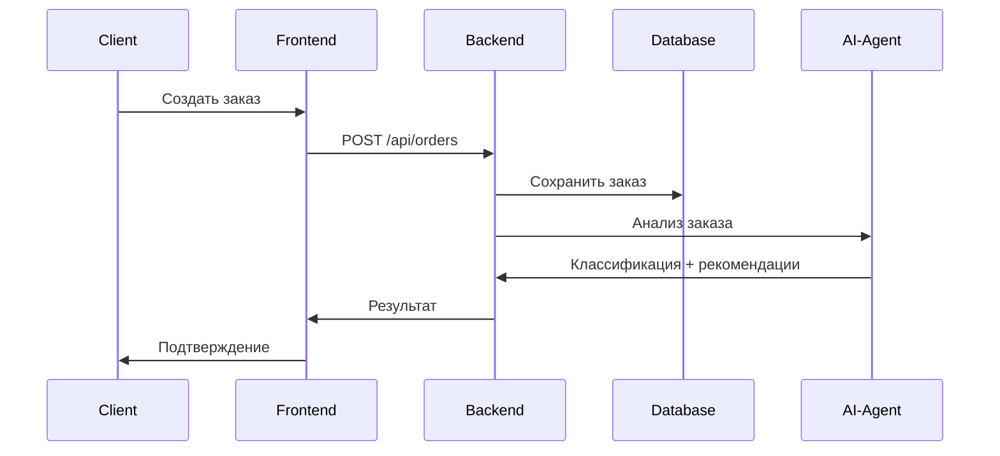
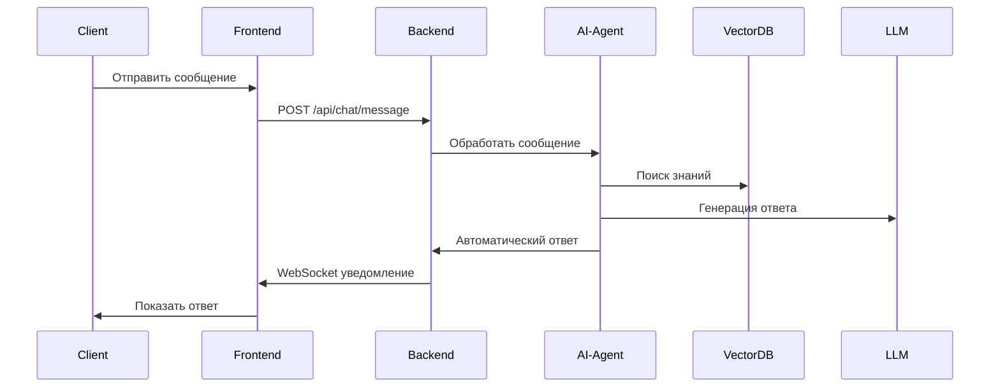

# 🏗️ Архитектура Консервс-Сервиса

## 📋 Обзор Системы

Консервс-сервис представляет собой современную платформу для управления услугами, построенную на микросервисной архитектуре с интеграцией AI-агента.

## 🔄 Архитектурные Принципы

### 1. **Разделение Ответственности**
- **Frontend**: Пользовательский интерфейс и UX
- **Backend**: Бизнес-логика и API
- **AI-Agent**: Автоматизация и обработка естественного языка
- **Database**: Хранение данных и состояний

### 2. **Масштабируемость**
- Горизонтальное масштабирование сервисов
- Кэширование с Redis
- Асинхронная обработка задач

### 3. **Безопасность**
- JWT аутентификация
- RBAC (Role-Based Access Control)
- Валидация данных на всех уровнях
- Rate limiting

## 🏛️ Компоненты Системы

### Frontend (React + TypeScript)
```
frontend/
├── src/
│   ├── components/     # Переиспользуемые компоненты
│   ├── pages/          # Страницы приложения
│   ├── hooks/          # Custom React hooks
│   ├── store/          # Redux store
│   ├── services/       # API клиенты
│   └── utils/          # Утилиты
└── public/             # Статические файлы
```

**Ключевые возможности:**
- Responsive дизайн
- Real-time уведомления (Socket.IO)
- Офлайн режим (PWA)
- Многоязычность (i18n)

### Backend (Node.js + Express + TypeScript)
```
backend/
├── src/
│   ├── routes/         # API маршруты
│   ├── controllers/    # Контроллеры
│   ├── services/       # Бизнес-логика
│   ├── models/         # Модели данных
│   ├── middleware/     # Промежуточное ПО
│   ├── utils/          # Утилиты
│   └── config/         # Конфигурация
└── tests/              # Тесты
```

**API Endpoints:**
- `/api/auth` - Аутентификация
- `/api/users` - Управление пользователями
- `/api/orders` - Управление заказами
- `/api/chat` - Чат и сообщения
- `/api/payments` - Платежи
- `/api/analytics` - Аналитика

### AI-Agent (Python + FastAPI)
```
ai-agent/
├── src/
│   ├── core/           # Ядро AI-агента
│   ├── models/         # ML модели
│   ├── services/       # AI сервисы
│   ├── utils/          # Утилиты
│   └── training/       # Обучение моделей
├── data/               # Данные для обучения
└── tests/              # Тесты
```

**Возможности AI-агента:**
- Обработка естественного языка
- Классификация заявок
- Автоматические ответы
- Анализ настроений
- Рекомендации

## 🗄️ База Данных

### PostgreSQL Schema
```sql
-- Основные таблицы
Users (id, email, role, status, ...)
Orders (id, title, status, client_id, manager_id, ...)
Messages (id, content, user_id, order_id, ...)
ChatSessions (id, user_id, is_active, ...)
Payments (id, amount, status, order_id, ...)
AIKnowledge (id, question, answer, category, ...)
```

### Redis Cache
- Сессии пользователей
- Кэш API ответов
- Rate limiting данные
- Real-time данные

## 🔄 Поток Данных

### 1. Создание Заказа


### 2. AI-Обработка Сообщений


## 🔐 Безопасность

### Аутентификация
```typescript
// JWT токены
interface JWTPayload {
  userId: string;
  email: string;
  role: UserRole;
  exp: number;
}

// Middleware проверки
const authMiddleware = (req, res, next) => {
  const token = req.headers.authorization?.split(' ')[1];
  const decoded = jwt.verify(token, JWT_SECRET);
  req.user = decoded;
  next();
};
```

### Авторизация (RBAC)
```typescript
enum UserRole {
  CLIENT = 'CLIENT',
  MANAGER = 'MANAGER',
  CONTRACTOR = 'CONTRACTOR',
  ADMIN = 'ADMIN'
}

const rolePermissions = {
  [UserRole.CLIENT]: ['order:create', 'order:view:own'],
  [UserRole.MANAGER]: ['order:view:all', 'order:assign'],
  [UserRole.ADMIN]: ['*']
};
```

## 📊 Мониторинг и Логирование

### Метрики
- Время ответа API
- Использование ресурсов
- Ошибки и исключения
- Активность пользователей

### Логирование
```typescript
// Structured logging
logger.info('Order created', {
  orderId: order.id,
  clientId: order.clientId,
  amount: order.budget,
  timestamp: new Date().toISOString()
});
```

## 🚀 Развертывание

### Docker Compose
```yaml
services:
  frontend:
    build: ./frontend
    ports: ["3000:3000"]
  
  backend:
    build: ./backend
    ports: ["3001:3001"]
    depends_on: [database, redis]
  
  ai-agent:
    build: ./ai-agent
    ports: ["8000:8000"]
    depends_on: [database]
  
  database:
    image: postgres:14
    environment:
      POSTGRES_DB: conserv_service
  
  redis:
    image: redis:7-alpine
```

### CI/CD Pipeline
1. **Test**: Запуск тестов
2. **Build**: Сборка Docker образов
3. **Deploy**: Развертывание в production
4. **Monitor**: Мониторинг здоровья системы

## 📈 Планы Масштабирования

### Фаза 1: Оптимизация
- Кэширование API ответов
- Оптимизация запросов к БД
- CDN для статики

### Фаза 2: Микросервисы
- Выделение сервисов: User, Order, Payment, Notification
- Message queue (RabbitMQ/Apache Kafka)
- Service mesh (Istio)

### Фаза 3: Глобальное Масштабирование
- Geo-distributed database
- Multi-region deployment
- Edge computing

---

*Архитектура разработана с учетом современных практик и готова к масштабированию 🚀*